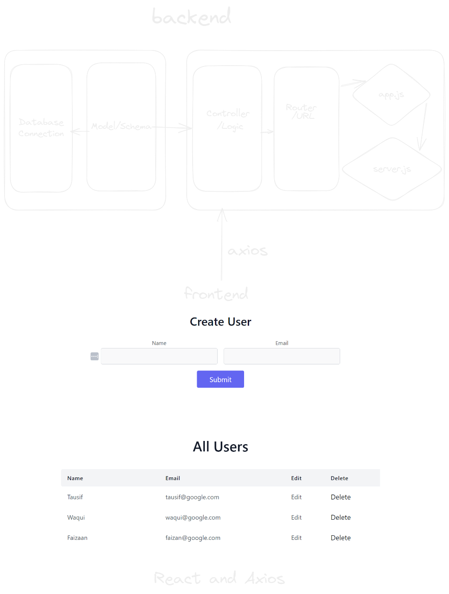

# **CRUD App**
This is a simple CRUD (Create, Read, Update, Delete) app that allows users to perform basic CRUD operations on a list of users. The app consists of a frontend built with React and a backend built with Node.js and Express.

## Getting Started

To run the app locally, you'll need to follow these steps:

1. Clone this repository to your local machine.
2. Install the required dependencies for both the frontend and backend. You can do this by running `npm install` in the `server` directory of the project as well as in the `client` directory.
3. Start the backend server by running `npm start` in the `server` directory of the project. You can also do it by running `npm run dev` if you are using dev dependencies like `nodemon`
4. Start the frontend server by running `npm start` in the `client` directory. You have to set a proxy like `"proxy": "http://localhost:4000",` and comment out the `BASE_URL` if you want to use it on local machine

## Backend
The backend of the app is built with Node.js and Express. It provides the necessary endpoints for performing CRUD operations on the list of users. The endpoints are as follows:

- `GET /getUsers`: Returns a list of all the users.
- `POST /addUser`: Adds a new user to the list.
- `PUT /updateUser/:id`: Updates an existing user with the specified ID.
- `DELETE /deleteUser/:id`: Deletes a user with the specified ID.

The backend uses MongoDB as its database to store the list of users. The database connection string is stored in the `.env` file.

## Frontend
The frontend of the app is built with React. It provides a simple UI for performing CRUD operations on the list of users. The main components of the frontend are as follows:
- `App.js`: The main component of the app. It fetches the list of users from the backend and passes it down to the other components.
- `Form.js`: A form component for adding new users to the list.
- `UserList.js`: A list component that displays all the users and allows the user to edit or delete them.
The frontend uses Axios to communicate with the backend and perform CRUD operations on the list of users. The base URL for the backend server is stored in the `BASE_URL` constant in `App.js`.

## Conclusion
This is a simple CRUD app that demonstrates how to build a basic web application with React and Node.js. It can be used as a starting point for building more complex apps that require database integration and server-side logic.

  

 